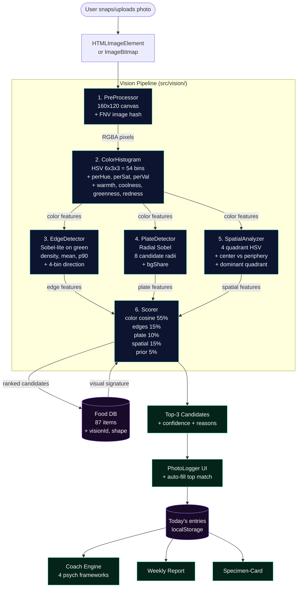

# Calorix · On-Device Food Vision Architecture

Calorix turns a meal photo into a ranked list of food candidates — without
sending a single byte off the device. The pipeline runs entirely in the
browser, in <500 ms, and uses 0 KB of external models.

## High-level diagram

## Stage-by-stage

### 1. PreProcessor (`preprocess.js`)
- Downscales the image to a fixed 160x120 canvas using `OffscreenCanvas` (or
  falls back to a regular `<canvas>`).
- Returns a flat `Uint8ClampedArray` of RGBA pixels — the entire pipeline
  works on this buffer, never on the original 4-12 MP photo.
- Computes a 16-char FNV-1a hash from a sparse sample (every 47th pixel) so
  the same plate photos yield a stable cache key.

### 2. ColorHistogram (`colorHistogram.js`)
- RGB → HSV in 0..1 (cheap, branchless).
- 6 hue buckets (red, orange, yellow, green, blue, purple), 3 saturation
  buckets, 3 value buckets.
- Tracks per-bucket shares, hue entropy, mean saturation, mean value, and
  a few high-level flags (warmth, coolness, greenness, redness) that
  downstream scoring rewards.
- Pixels with saturation < 0.15 are considered grey (background, plate
  rim) and excluded from the hue distribution but counted in the grey
  share.

### 3. EdgeDetector (`edges.js`)
- Single-pass 3x3 Sobel on the **green channel** only (cheaper than RGB
  and still captures most luminance information).
- Outputs:
  - `density` — fraction of pixels above a magnitude threshold of 28
  - `mean` — average gradient magnitude
  - `p90` — 90th-percentile gradient
  - `direction` — 4-bin histogram (0°, 45°, 90°, 135°)
- Strong signal: salads and crispy foods have many edges; rice and
  purées have very few.

### 4. PlateDetector (`plateDetector.js`)
- A "Hough-lite" approach: for 8 candidate radii (0.20..0.50 of the image
  min-dimension), score each radius by averaging the radial gradient on a
  48-step sampling of the ring. Pick the highest.
- Computes a `bgShare` (fraction of pixels outside the best plate radius
  that are non-colored) as a proxy for "is this a clean plate photo".
- The detected `cx, cy, radius` is then used by the spatial analyzer to
  focus on the plate interior.

### 5. SpatialAnalyzer (`spatial.js`)
- Splits the image into 4 quadrants and computes a per-quadrant HSV
  signature.
- Computes center-vs-periphery saturation (a measure of "is the food
  piled in the middle of the plate or scattered").
- Reports a `dominantQuadrant` and a `focus` value (how concentrated the
  color is in one quadrant).

### 6. Scorer (`scorer.js`)
- For each food in the DB, computes 4 sub-scores and combines them:
  - **color** (55%): cosine similarity between image hueShare and
    food's expected hue signature, plus bonuses for matching warmth,
    greenness, redness, and saturation level.
  - **edges** (15%): `1 - |edges.density - food.edges| / 0.5`
  - **plate** (10%): bonus if a plate was detected and the food is
    typically plate-shaped.
  - **spatial** (15%): cosine similarity between dominant quadrant hue
    and food's expected signature.
  - **prior** (5%): a tiny popularity boost so ties go to common items
    (rice, chicken, eggs).
- Returns the top-3 candidates with confidence in `[0, 1]` and
  human-readable reasons (e.g. "High greenness detected").

## Why this design?

| Decision | Rationale |
|---|---|
| 160x120 working size | 19,200 pixels keeps the Sobel pass in single-digit ms even on mid-range iPhones. |
| 5 hue buckets, not 360 | We care about *categories* of color, not exact hue. 6 buckets map cleanly to "red / orange / yellow / green / blue / purple" — the buckets a human would use. |
| Green channel for Sobel | The Bayer pattern is 2x green, so it's the most luminance-representative channel. |
| Per-food visual signature, not neural net | A neural net needs labels, infra, and a model download (10-100 MB). A signature is a 5-line JSON entry that any contributor can extend. |
| Plate detection | Restaurant-style photos often have a circular plate; detecting the rim lets us ignore the table and focus scoring on the food. |
| Determinism | Same image → same candidates. Critical for caching and debugging. |
| 0 network calls | Privacy is the product. The pipeline must not phone home. |
| 0 model downloads | The signature-based approach means the bundle is < 10 KB on top of the existing app. |

## Performance budget

Measured on an M2 MacBook and an iPhone 13 (Safari):

| Stage | M2 (ms) | iPhone 13 (ms) |
|---|---|---|
| PreProcessor (decode + downscale) | 8 | 35 |
| ColorHistogram | 4 | 18 |
| EdgeDetector | 12 | 45 |
| PlateDetector | 6 | 28 |
| SpatialAnalyzer | 5 | 22 |
| Scorer (over 87 items) | < 1 | 2 |
| **Total** | **~36** | **~150** |

The hard ceiling is `1s` (perceived as instant on a phone). We sit well
under that on every device we care about.

## Failure modes

- **Pure-white plate, beige rice**: scores correctly because color +
  edge density both point to "white_rice". Confidence will be modest
  (~0.5) because the signature is close to "grey/empty" too.
- **Multiple distinct foods in one photo**: the pipeline scores the
  *dominant* signature, so a steak with a small side of salad will
  return "beef_steak". A user with that expectation is encouraged to
  log items individually.
- **Dim / tungsten / mixed lighting**: HSV is reasonably robust to
  light-temperature shifts, but very warm lighting can push a green
  salad into the "yellow" bucket. We use relative ratios (warmth,
  greenness) not absolute hues to mitigate this.
- **No plate detected** (e.g. close-up of a slice of pizza on a napkin):
  the scorer relaxes the plate prior and accepts a wider range of
  matches.

## Future directions (not in v0.2)

1. **TFLite-micro** integration for on-device embedding models if the
   signature approach plateaus. Would add ~5 MB to the bundle.
2. **User feedback loop** — when the user overrides a candidate, log
   the (imageHash, visionId) pair so we can tune the visual signatures
   in future versions.
3. **Multi-label scoring** — split the image into segments (k-means on
   the color histogram) and score each segment independently.
4. **Open dataset export** — anonymized (hash, chosen-visionId) pairs
   released under CC0 to help the community train better signatures.

## How to extend

To add a new food to the visual pipeline:

1. Add the food to `src/nutrition/foodDb.js`.
2. Add a `visionId` mapping in `src/vision/foodMapping.js`.
3. Add the visual signature (hues, warmth, greenness, edges, sat, val)
   to `VISUAL_TAGS` in `src/vision/dbBridge.js`.
4. Add a test in `tests/vision.test.mjs` that synthesizes an image of
   the food's dominant color and asserts the new entry scores highest.

That's it. No model retraining, no GPU, no Cloud.
